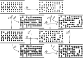
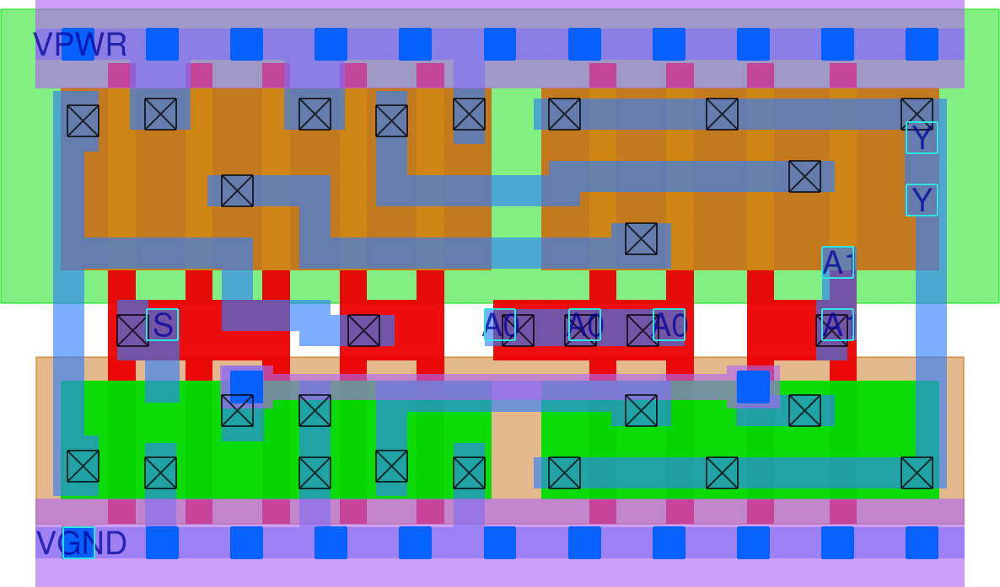
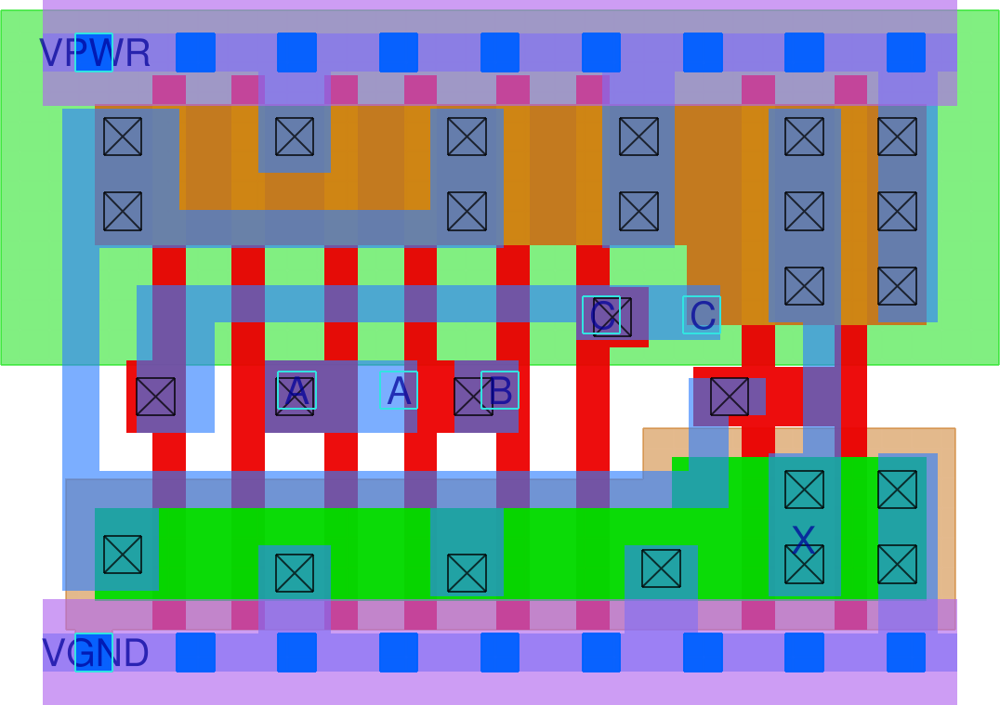
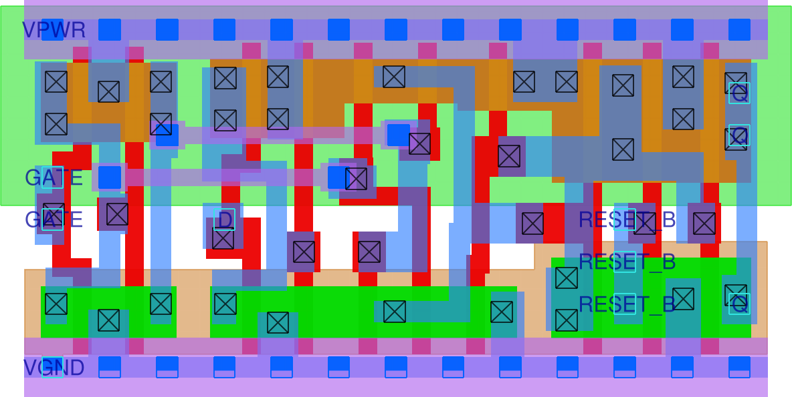
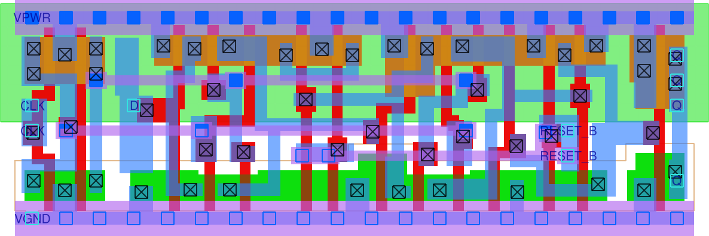
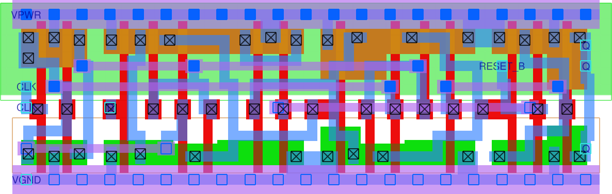
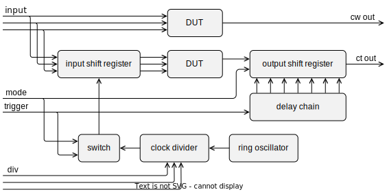

  

# Standard cell generator and tester

This repository contains

- a standard cell generator for sky130, written in python using the gdstk library
- four example cells ready to drop into the openlane flow
- a TinyTapeout design wrapping the example cells in an instrumentation framework

## Cell generator

Cells are built from a discrete representation. For each layer, blocks are placed in
some tiles of a 6 &times; n grid. These blocks are then shifted and resized in fixed
increments, and certain pairs of adjacent blocks are connected to each other:

Generated cells are then written to gds, lef, mag & maglef files to allow using them
in the openlane flow. (Verilog models and liberty characterization data have to be
created separately.)

Cells are designed to be mixed-and-matched with cells from the `sky130_fd_sc_hd`
library.

The cell generator lives in the [`pdk-gen`](pdk-gen) directory of the source tree.
The generator itself is in [`skygen.py`](pdk-gen/skygen.py)
while inputs for the example cells are in [`cells.py`](pdk-gen/cells.py).

## Example cells

Four cells from the `sky130_fd_sc_hd` library were recreated using the generator.

### [`mux2i`](https://skywater-pdk.readthedocs.io/en/main/contents/libraries/sky130_fd_sc_hd/cells/mux2i/README.html) (2-input multiplexer, output inverted)

foundry version `sky130_fd_sc_hd__mux2i_2`:

custom version `sky130_ht_sc_tt05__mux2i_2`:

### [`maj3`](https://skywater-pdk.readthedocs.io/en/main/contents/libraries/sky130_fd_sc_hd/cells/maj3/README.html) (3-input majority vote)

foundry version `sky130_fd_sc_hd__maj3_2`:

custom version `sky130_ht_sc_tt05__maj3_2`:

### [`dlrtp`](https://skywater-pdk.readthedocs.io/en/main/contents/libraries/sky130_fd_sc_hd/cells/dlrtp/README.html) (delay latch with inverted reset)

foundry version `sky130_fd_sc_hd__dlrtp_1`:

custom version `sky130_ht_sc_tt05__dlrtp_1`:

### [`dfrtp`](https://skywater-pdk.readthedocs.io/en/main/contents/libraries/sky130_fd_sc_hd/cells/dfrtp/README.html) (delay flop with inverted reset)

foundry version `sky130_fd_sc_hd__dfrtp_1`:

custom version `sky130_ht_sc_tt05__dlrtp_1`:

These cells are included in the [`pdk`](pdk) directory, structured in
the same way as the official sky130 pdk so that you can copy them into
`$PDK_ROOT/sky130A/libs.ref/sky130_fd_sc_hd` to use with openlane.
Just don't use them for anything serious, they are not that thoroughly tested.

The subdirectories [`gds`](pdk/gds), [`lef`](pdk/lef), [`mag`](pdk/mag) and
[`maglef`](pdk/maglef) are outputs from the generator.
Netlists in [`spice`](pdk/spice) were extracted using magic while models
in [`verilog`](pdk/verilog) and characterization data in [`lib`](pdk/lib)
were just copied from the corresponding foundry cells.

There are some quick analog tests using ngspice in the [`pdk-test`](pdk-test)
directory.

## TinyTapeout design

A test design incorporating the example cells was submitted to [TT05](https://tinytapeout.com/runs/).

It contains 8 copies of the following structure with the 4 foundry cells and
the 4 custom cells inserted as DUT.
(The ring oscillator, clock divider and switch are shared between the copies.)

For simple tests, a copy of the cell is directly attached to the inputs and one
of the outputs.

For advanced tests, a shift register is inserted in the input and output paths
that can be driven much faster than the chip IO would allow.

When mode is 0, the switch relays the trigger signal and the output shift
register performs regular rotations. This allows slow rotation from input
to output through the DUT to check the pipeline as well as preloading inputs
and reading outputs of the advanced tests.

When mode is 1, the switch gates the divided clock from the ring oscillator
using the trigger signal, and the output shift register captures the DUT output
into each of its bits according to the trigger running through a fast delay chain.
So on a trigger signal the preloaded inputs are played at the pace of the
divided clock and the DUT output is sampled into the output buffer at times
indicated by the delay chain.

Pins for the TinyTapeout design are allocated as follows:

Input pins:

- 0: `mux2i.A0` / `maj3.A` / `dlrtp.GATE` / `dfrtp.CLK`
- 1: `mux2i.A1` / `maj3.B` / `dlrtp.D` / `dfrtp.D`
- 2: `mux2i.S` / `maj3.C` / `dlrtp.RESET_B` / `dfrtp.RESET_B`
- 3: `mode`
- 4: `trigger`
- 5: `div` bit 0
- 6: `div` bit 1
- 7: `div` bit 2

Output pins:

- foundry `mux2i(A0, A1, S)` direct output
- custom `mux2i(A0, A1, S)` direct output
- foundry `maj3(A, B, C)` direct output
- custom `maj3(A, B, C)` direct output
- foundry `dlrtp(GATE, D, RESET_B)` direct output
- custom `dlrtp(GATE, D, RESET_B)` direct output
- foundry `dfrtp(CLK, D, RESET_B)` direct output
- custom `dfrtp(CLK, D, RESET_B)` direct output

Bidirectional pins, used in output mode:

- foundry `mux2i(A0, A1, S)` through pipeline
- custom `mux2i(A0, A1, S)` through pipeline
- foundry `maj3(A, B, C)` through pipeline
- custom `maj3(A, B, C)` through pipeline
- foundry `dlrtp(GATE, D, RESET_B)` through pipeline
- custom `dlrtp(GATE, D, RESET_B)` through pipeline
- foundry `dfrtp(CLK, D, RESET_B)` through pipeline
- custom `dfrtp(CLK, D, RESET_B)` through pipeline

Verilog sources for the design are in the [`src`](src) directory,
along with a cocotb testbench in [`test.py`](src/test.py).
