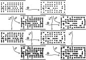
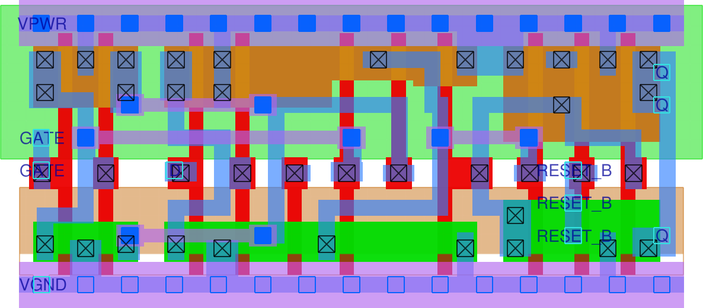

  

# Standard cell generator and tester

This repository contains

- a standard cell generator for sky130, written in python using the gdstk library
- four example cells in various formats
- a TinyTapeout design for testing the example cells in silicon

## Cell generator

Cells are built from a discrete representation. For each layer, blocks are placed in
some tiles of a 6 &times; n grid. These blocks are then shifted and resized in fixed
increments, and certain pairs of adjacent blocks are connected to each other:

Generated cells are then written to gds, lef, mag & maglef files to allow using them
in the openlane flow. (Verilog models and liberty characterization data have to be
created separately.)

Cells are designed to be mixed-and-matched with cells from the `sky130_fd_sc_hd`
library.

The cell generator lives in the [`pdk-gen`](pdk-gen) directory of the source tree.
The generator itself is in [`skygen.py`](pdk-gen/skygen.py)
while inputs for the example cells are in [`cells.py`](pdk-gen/cells.py).

## Example cells

Four cells from the `sky130_fd_sc_hd` library were recreated using the generator.

### [`mux2i`](https://skywater-pdk.readthedocs.io/en/main/contents/libraries/sky130_fd_sc_hd/cells/mux2i/README.html) (2-input multiplexer, output inverted)

foundry version `sky130_fd_sc_hd__mux2i_2`:

custom version `sky130_ht_sc_tt05__mux2i_2`:

### [`maj3`](https://skywater-pdk.readthedocs.io/en/main/contents/libraries/sky130_fd_sc_hd/cells/maj3/README.html) (3-input majority vote)

foundry version `sky130_fd_sc_hd__maj3_2`:

custom version `sky130_ht_sc_tt05__maj3_2`:

### [`dlrtp`](https://skywater-pdk.readthedocs.io/en/main/contents/libraries/sky130_fd_sc_hd/cells/dlrtp/README.html) (delay latch with inverted reset)

foundry version `sky130_fd_sc_hd__dlrtp_1`:

custom version `sky130_ht_sc_tt05__dlrtp_1`:

### [`dfrtp`](https://skywater-pdk.readthedocs.io/en/main/contents/libraries/sky130_fd_sc_hd/cells/dfrtp/README.html) (delay flop with inverted reset)

foundry version `sky130_fd_sc_hd__dfrtp_1`:

custom version `sky130_ht_sc_tt05__dlrtp_1`:

These cells are included in the [`pdk`](pdk) directory, structured in
the same way as the official sky130 pdk so that you can copy them into
`$PDK_ROOT/sky130A/libs.ref/sky130_fd_sc_hd` to use with openlane.
Just don't use them for anything serious, they are not that thoroughly tested.

The subdirectories [`gds`](pdk/gds), [`lef`](pdk/lef), [`mag`](pdk/mag) and
[`maglef`](pdk/maglef) are outputs from the generator.
Netlists in [`spice`](pdk/spice) were extracted using magic while models
in [`verilog`](pdk/verilog) and characterization data in [`lib`](pdk/lib)
were just copied from the corresponding foundry cells.

There are some quick analog tests using ngspice in the [`pdk-test`](pdk-test)
directory.

## TinyTapeout design

TODO
